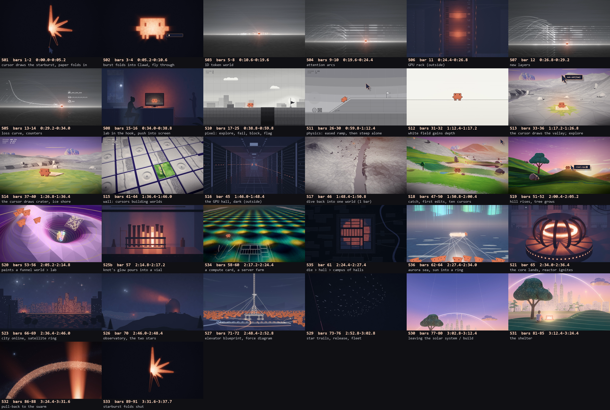

# Shelter: a code-rendered music video

A music video for "Shelter" (Porter Robinson & Madeon, 2016), in which every frame is rendered by code.
Written, animated and rendered with Claude Opus 5.5 in Claude Code.

## The story

Clawd, Claude's little pixel mascot, grows up inside training environments that people build for it.
People help it, then hand it the tools. What it makes becomes real breakthroughs in the outside world,
which is always backlit cut paper: medicine, compute, fusion, a city, a space elevator, a fleet of
light sails. At the end it builds a shelter, a simulation hosted in a Dyson swarm around Alpha
Centauri B.

## How it's made

- Every shot is an ES module in `shots/` with `setup(ctx)` and `render(ctx, fr)`, a pure function of
  the frame number. Shared scene code lives in `sets/`, and helpers in `lib/`.
- `render/render.mjs` drives headless Chrome (WebGL2 and Canvas 2D) and pipes raw frames into ffmpeg.
  `render/assemble.mjs` cuts the shots into the film.
- Everything is keyed to bars of the song, not timestamps. Beats, bass stops, sung onsets and
  per-stem loudness come from `analysis/` (Demucs stems, beat tracking and features), exported to
  `render/data/` for the renderer.
- `shots.json` is the shot list.
  `render/GUIDE.md` is the handbook the agents worked from, and `render/briefs/` has the per-revision
  briefs. `CLAUDE.md` holds the production state.
- `style-frames/` is the look development: the rejected styles, the fidelity ladder and the
  paper-world references.

## Rendering it yourself

The song isn't included. You need your own copy.

1. Put it at `Shelter.mp3` in the repo root.
2. Build the analysis with Python 3 and torch, librosa, demucs and beat_this:
   `analysis/separate.py`, `beats.py`, `features.py`, `vocal.py` and `sections.py`, then
   `render/export_env.py`. `render/data/` is already included, so the shots render without this
   step; only the final assembly needs `analysis/shelter.wav`.
3. With Node 24, Chrome and ffmpeg: `node render/render.mjs all`, then `node render/assemble.mjs`.
   The film is written to `out/film.mp4`. Expect about an hour at 1080p on a laptop GPU.

No lyrics appear anywhere in this repository, by design: every file refers to the song only by
bars and timing.
